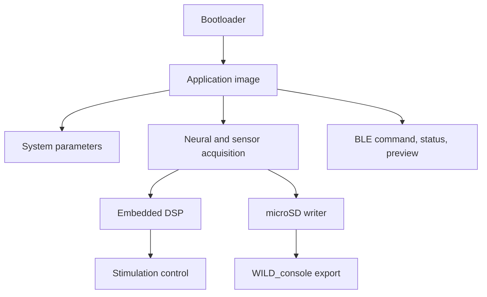

# Firmware Architecture

The WILD firmware is organized around deterministic acquisition, local recording, BLE control, and optional closed-loop compute.

## Main Responsibilities

- Start from bootloader or application image.
- Validate and apply system parameters.
- Acquire neural and auxiliary channels.
- Write data to microSD in the WILD recording layout.
- Respond to BLE commands from WILD_console.
- Run online filters and closed-loop logic when enabled.
- Provide preview and state data for live monitoring.

## Timing and Release Traceability

Firmware behavior should be tied to a named binary and hardware revision. For experiments that use closed-loop detection, TinyML, or multi-device synchronization, record the firmware image name, WILD hardware revision, sampling mode, enabled modalities, and host software version with the dataset.
