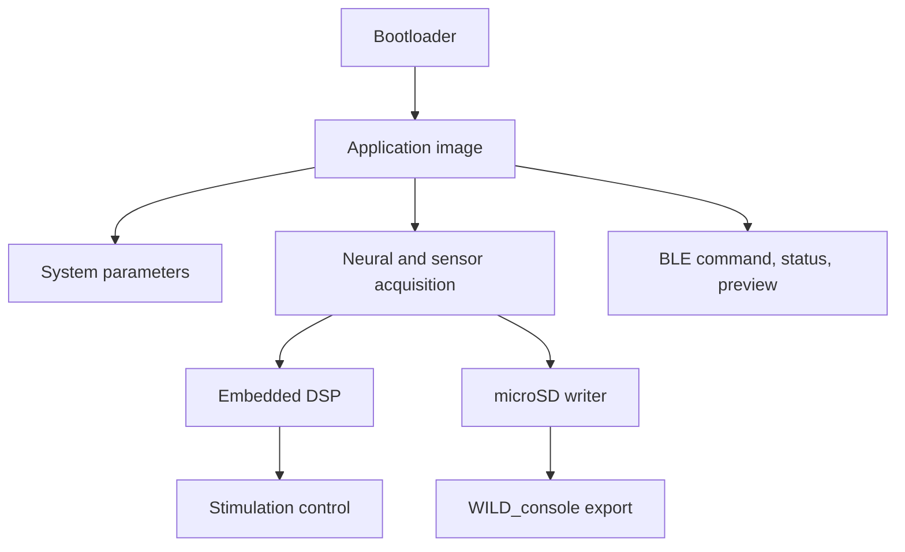

# Firmware Architecture

The WILD firmware is organized around deterministic acquisition, local recording, BLE control, and optional closed-loop compute.

## Main Responsibilities

- Start from bootloader or application image.
- Validate and apply system parameters.
- Acquire neural and auxiliary channels.
- Write data to microSD in the WILD/CE32 recording layout.
- Respond to BLE commands from WILD_console.
- Run online filters and closed-loop logic when enabled.
- Provide preview and state data for live monitoring.

## Recommended Documentation Additions

- Task and interrupt diagram.
- Timing budget for acquisition, SD writes, BLE preview, and DSP.
- Firmware state machine.
- Binary release checklist.
