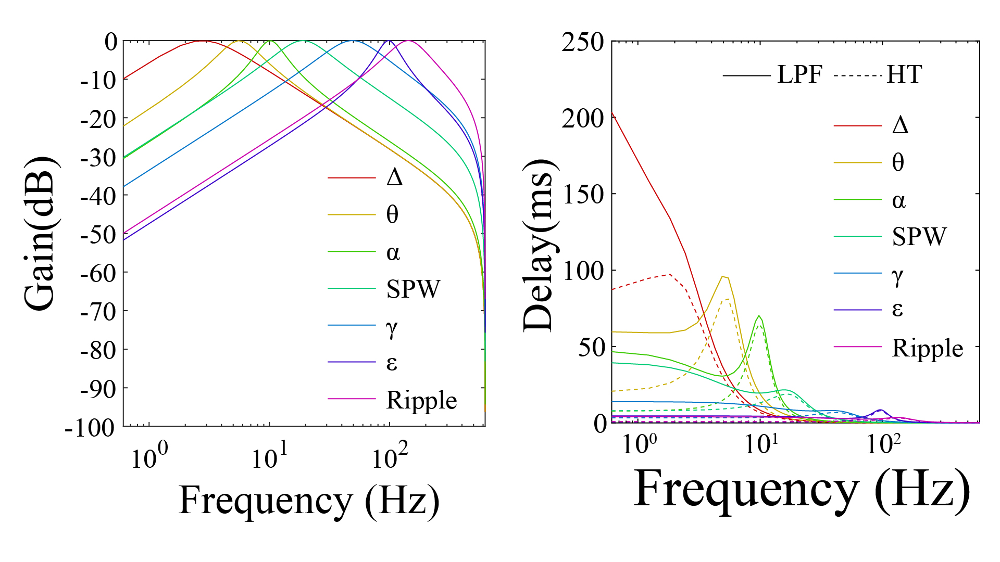

# DSP and Closed-loop Control

WILD supports online filtering, event detection, and stimulation logic for closed-loop experiments.

Closed-loop behavior is implemented on the device through embedded DSP and curated TinyML pipelines. This enables low-latency responsive stimulation without requiring continuous wireless transmission of high-bandwidth neural data.

## DSP Modes

- Disabled.
- Single channel.
- Single channel with Hilbert transform.
- Double channel.
- Double channel with Hilbert transform.
- Cascade filtering.
- Gated detection.
- Random triggering.

## Filters

{ .wild-readable-figure }

Current filter families include delta, theta, alpha, beta, gamma, epsilon, and ripple.

## Referencing

- Direct: `x = A`.
- Differential: `x = A - B`.
- Current source density style: `x = 2A - B - C`.

## Stimulation Parameters

Operator-facing stimulation parameters include pulse width, delay, frequency, train length, random delay, intensity, and channel mapping. Record the firmware version and hardware configuration used for validation with each closed-loop experiment.

!!! important
    Closed-loop detection and stimulation should be validated on the bench before in vivo experiments.
