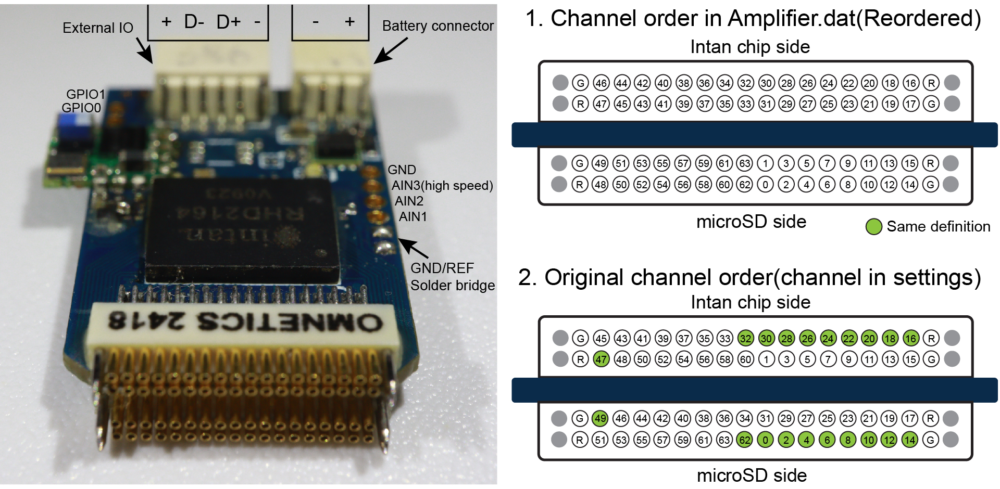
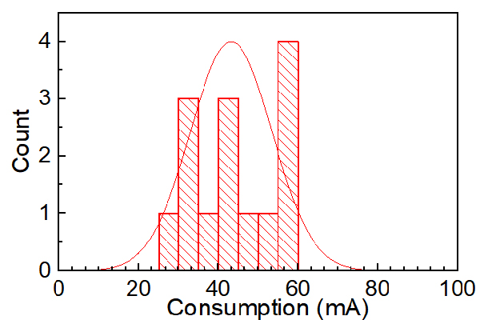
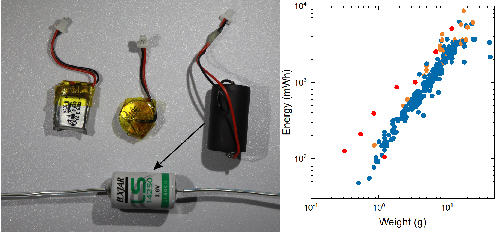

# Hardware Setup

This checklist covers the physical preparation before connecting WILD to software.

## Device and Connectors

Use the connector images to identify the stimulation, auxiliary, sensor, sync, and battery interfaces before powering the board.

{ .wild-readable-figure }

## Preparation Checklist

1. Inspect the PCB and connectors for visible damage.
2. Confirm battery polarity on the JST-SH connector.
3. Insert a tested microSD card.
4. Confirm the recording probe, stimulation output, IMU, microphone, camera, and sync connections needed for the experiment.
5. Confirm the device is running the expected released device image for the experiment.

## microSD Card

Format the card from WILD_console before recording. The microSD card affects both reliability and power draw.

{ .wild-readable-figure }

Treat battery and SD guidance as part of the experimental protocol, not as optional accessory setup.

{ .wild-readable-figure }

## Released Device Image

Public setup documentation uses prebuilt WILD release images. Select the release image that matches the hardware revision and experimental configuration, then record the release tag and image filename with the dataset metadata.

Release images are distributed through the [latest GitHub release](https://github.com/zifangzhao/Neurologger/releases/latest). Follow the release notes for the specific image used in the experiment.

Keep a record of the release image used for each experiment so analysis metadata can be traced later.
