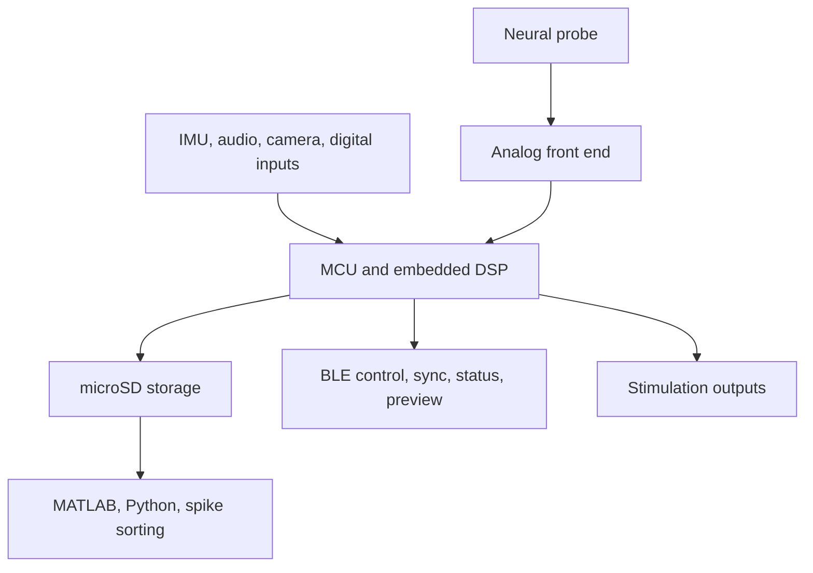

# Device Overview

The WILD device is a Wireless, Interactive, Lightweight Datalogger: an ultra-lightweight multimodal neurologger for freely behaving animals. The device combines local neural data logging, auxiliary sensing, onboard processing, BLE configuration and status, synchronization, and responsive stimulation.

The WILD device is not a BLE telemetry system. High-bandwidth neural data are recorded locally to microSD; wireless links are used for discovery, configuration, synchronization, status, low-bandwidth preview, and online control commands.

{ .wild-readable-figure }

## Functional Blocks

## Current Public Scope

- The current open-source WILD device release is the 64-channel local-storage neurologger workflow.
- Higher-performance Neuropixels-compatible and active-SPI-probe workflows are separate research and variant targets.
- Multi-device experiments use explicit synchronization workflows rather than BLE timestamps alone.
- Mass is configuration-dependent; report device-only mass, probe or module mass, battery mass, and complete implant mass separately.

## Core Specifications

| Category | Current WILD specification |
| --- | --- |
| Neural channels | 64 |
| Device mass | Approximately 1.5 g for the logger board, configuration-dependent |
| Board dimensions | 23.3 x 15.7 mm |
| Battery input | 3.3-5 V |
| Sampling rates | 1,250-20,000 Hz |
| ADC resolution | 16-bit electrophysiology and microphone data; 10-bit camera data |
| Storage | microSD, Class 10 or better; low-power endurance cards are preferred |
| Recommended cards | Samsung EVO older orange U1 generation or tested Lexar cards |
| BLE | Bluetooth Low Energy 5.2 for control, synchronization support, status, and preview |
| IMU | BMX160, up to 500 Hz |
| USV microphone | SPH6611LR5H, approximately 1-80 kHz bandwidth |
| Camera | NanEye-C, 320-pixel class, 16 FPS, 10-bit |
| Stimulation | Optional two-channel laser-diode stimulation module based on TPS6115x |

## Supported Modalities

- Local neural electrophysiology recording.
- Responsive closed-loop stimulation from onboard detection.
- IMU sensing and sensor fusion.
- Ultrasonic vocalization audio through ADC data.
- Head-mounted camera data through `misc.dat`.
- Digital input and synchronization signals.
