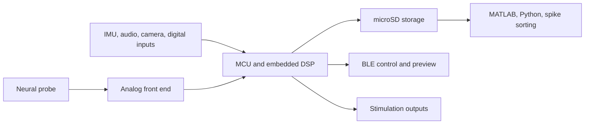

# Device Overview

WILD is a lightweight wireless neurologger for freely behaving animals. The platform combines neural recording, auxiliary sensing, local storage, BLE configuration, and closed-loop stimulation.

## Functional Blocks

## Supported Modalities

- Neural electrophysiology recording.
- Closed-loop stimulation.
- IMU sensing and sensor fusion.
- Ultrasonic vocalization audio through ADC data.
- Head-mounted camera data through `misc.dat`.
- Digital input and synchronization signals.

## What to Document Next

For public adoption, the device overview should eventually include mass, dimensions, channel configurations, supported probe families, battery life by mode, maximum sampling rates, and validated operating conditions.
