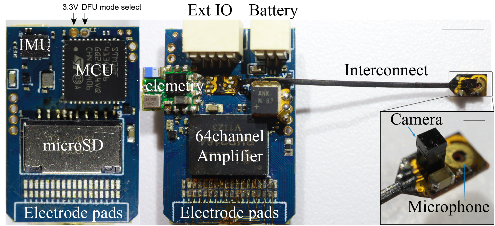
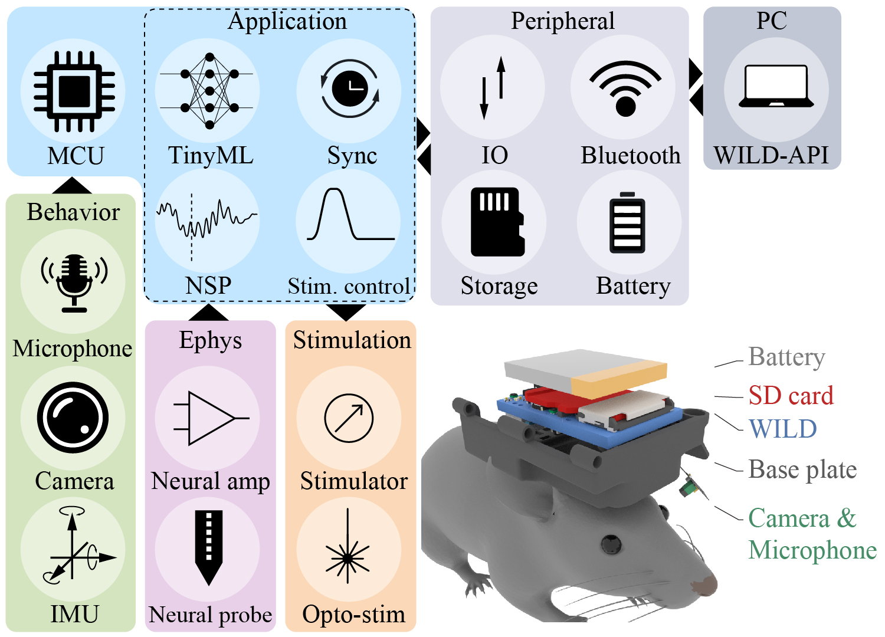

---
hide:
  - navigation
  - toc
---

<section class="wild-hero">
  <div>
    <h1>A wireless modular platform for neuro-behavioral recording and closed-loop manipulation in small animals</h1>
    <p>The Wireless, Interactive, Lightweight Datalogger (WILD) device is an ultra-lightweight multimodal neurologger for local neural data logging, behavioral sensing, onboard processing, and responsive stimulation in freely behaving animals.</p>
    <div class="wild-actions">
      <a class="md-button md-button--primary" href="getting-started/">Get Started</a>
      <a class="md-button" href="hardware/">Hardware</a>
      <a class="md-button" href="software/">Software</a>
      <a class="md-button" href="https://github.com/ayalab1/Neurologger">GitHub</a>
    </div>
    <div class="wild-signal-row">
      <span>64-Channel electrophysiology</span>
      <span>Closed-loop DSP</span>
      <span>9-axis IMU</span>
      <span>USV audio</span>
      <span>Camera</span>
    </div>
  </div>
  <figure class="wild-hero-media">
    
    <figcaption class="wild-caption">The WILD device integrates local neural recording, behavioral monitoring, real-time embedded processing, microSD storage, and wireless control for naturalistic systems neuroscience experiments.</figcaption>
  </figure>
</section>

<section class="wild-section">
  <div class="wild-grid two">
    <div class="wild-card">
      <h2>Current Public Workflow</h2>
      <p><strong>Stable public scope:</strong> 64-channel local-storage WILD workflow, WILD_console on Windows, validated release images, and post-processing through documented MATLAB and Python scripts.</p>
      <p><strong>Not the current public model:</strong> full-bandwidth BLE telemetry or arbitrary runtime AI-model upload.</p>
    </div>
    <div class="wild-card">
      <h2>Release Record</h2>
      <p>Use the <a href="https://github.com/ayalab1/Neurologger/releases/latest">latest GitHub release</a> and record the exact release tag, release image filename, hardware revision, WILD_console version, SD card, and battery in every experiment note.</p>
    </div>
  </div>

  <div class="wild-grid">
    <div class="wild-card">
      <h3>Run a first recording</h3>
      <p><a href="getting-started/hardware-setup/">Hardware Setup</a> -> <a href="getting-started/data-acquisition/">Data Acquisition</a> -> <a href="getting-started/data-analysis/">Data Analysis</a></p>
    </div>
    <div class="wild-card">
      <h3>Build hardware</h3>
      <p><a href="hardware/pcb/">PCB</a> -> <a href="hardware/mechanical/">Mechanical</a> -> <a href="hardware/power/">Power</a></p>
    </div>
    <div class="wild-card">
      <h3>Analyze data</h3>
      <p><a href="software/data-format/">Data Format</a> -> <a href="analysis/matlab/">MATLAB</a> -> <a href="analysis/python/">Python</a> -> <a href="analysis/spike-sorting/">Spike Sorting</a></p>
    </div>
    <div class="wild-card">
      <h3>Cite or reproduce a result</h3>
      <p><a href="publications/">Publications</a> -> release metadata -> reproducibility notes -> analysis script version</p>
    </div>
  </div>
</section>

<section class="wild-zoom-tour" aria-label="WILD device zoom tour">
  <div class="wild-zoom-stage" aria-live="polite">
    <h2 id="wild-zoom-title">Embedded control at the headstage</h2>
    <p id="wild-zoom-description">The MCU, IMU, and board-level control electronics sit close to the animal, reducing external cabling while keeping timing-sensitive acquisition local.</p>
    <figure class="wild-zoom-frame">
      
      <figcaption id="wild-zoom-label">MCU and IMU</figcaption>
    </figure>
  </div>

  <div class="wild-zoom-scroll" aria-hidden="true">
    <div class="wild-zoom-step" data-zoom-label="MCU and IMU" data-zoom-x="10%" data-zoom-y="10%" data-zoom-scale="2.5" data-zoom-title="Embedded control at the headstage" data-zoom-description="The MCU, IMU, and board-level control electronics sit close to the animal, reducing external cabling while keeping timing-sensitive acquisition local."></div>
    <div class="wild-zoom-step" data-zoom-label="microSD storage" data-zoom-x="10%" data-zoom-y="62%" data-zoom-scale="2.35" data-zoom-title="Local storage for long sessions" data-zoom-description="Recording data is stored on-device, preserving full-resolution datasets for long sessions while BLE remains available for control and preview."></div>
    <div class="wild-zoom-step" data-zoom-label="Amplifier and electrode pads" data-zoom-x="43%" data-zoom-y="82%" data-zoom-scale="2.3" data-zoom-title="Neural interface and probe connection" data-zoom-description="Amplifier and electrode-pad regions route neural signals into the acquisition stack for downstream preprocessing and analysis."></div>
    <div class="wild-zoom-step" data-zoom-label="Ext IO and battery connectors" data-zoom-x="47%" data-zoom-y="0%" data-zoom-scale="2.5" data-zoom-title="Modular power and IO" data-zoom-description="Connector regions support external modules, battery connection, synchronization, and configuration workflows for different experiment designs."></div>
    <div class="wild-zoom-step" data-zoom-label="Camera and microphone" data-zoom-x="115%" data-zoom-y="70%" data-zoom-scale="1.8" data-zoom-title="Behavioral sensing add-ons" data-zoom-description="Camera and microphone modules extend the WILD device from neural recording into synchronized neuro-behavioral datasets."></div>
  </div>
</section>

<section class="wild-section">
  <h2>Key Features</h2>
  <p>The WILD device is built around local neural logging, responsive stimulation, embedded processing, multimodal sensing, and long-duration experiments.</p>
  <div class="wild-grid">
    <div class="wild-card">
      <h3>Local Neural Logging</h3>
      <p>High-bandwidth electrophysiology is recorded locally to microSD, while BLE supports setup, synchronization, status, and low-bandwidth preview.</p>
    </div>
    <div class="wild-card">
      <h3>Responsive Stimulation</h3>
      <p>Onboard biomarker detection and behavioral classification can trigger stimulation without requiring continuous wireless data streaming.</p>
    </div>
    <div class="wild-card">
      <h3>TinyML on Edge Devices</h3>
      <p>Curated models run on the MCU through validated release images with RAM, timing, and closed-loop latency reviewed before deployment.</p>
    </div>
    <div class="wild-card">
      <h3>Multimodal Sensing</h3>
      <p>Neural signals, IMU, auxiliary inputs, ultrasonic audio, camera, and digital events.</p>
    </div>
    <div class="wild-card">
      <h3>Long-term Recording</h3>
      <p>Local storage, low power operations, and robust export tools for naturalistic studies.</p>
    </div>
  </div>
</section>

<section class="wild-section">
  <h2>Device Specification Summary</h2>
  <p>Representative WILD device operating modes show how channel count, aggregate sample rate, sensing modules, and onboard processing affect power draw.</p>
  <div class="wild-spec-scroll" role="region" aria-label="WILD device operating mode specification summary" tabindex="0">
    <table class="wild-spec-table">
      <thead>
        <tr>
          <th>Power (mW)</th>
          <th>Channels</th>
          <th>Aggregate samples/s</th>
          <th>Mode</th>
          <th>Weight (g)</th>
          <th>Video</th>
          <th>Audio</th>
          <th>Motion sensor</th>
          <th>Processing</th>
        </tr>
      </thead>
      <tbody>
        <tr><td>0.11</td><td>0</td><td>0</td><td>Sleep</td><td>1.48</td><td>-</td><td>-</td><td>-</td><td>-</td></tr>
        <tr><td>24.42</td><td>8</td><td>4 x 10^4</td><td>Ephys, IMU</td><td>1.48</td><td>-</td><td>-</td><td>Accelerometer, gyroscope, magnetometer</td><td>Spectral power, TinyML</td></tr>
        <tr><td>194.04</td><td>64</td><td>2.6 x 10^6</td><td>Ephys, IMU</td><td>1.48</td><td>-</td><td>-</td><td>Accelerometer, gyroscope, magnetometer</td><td>Spectral power, TinyML</td></tr>
        <tr><td>208.67</td><td>64</td><td>2.92 x 10^6</td><td>Ephys, IMU, audio</td><td>1.48</td><td>-</td><td>160 kHz</td><td>Accelerometer, gyroscope, magnetometer</td><td>Spectral power, TinyML</td></tr>
        <tr><td>245.28</td><td>64</td><td>5.48 x 10^6</td><td>Ephys, IMU, audio, video</td><td>1.48</td><td>320 x 320 px, 16 Hz</td><td>160 kHz</td><td>Accelerometer, gyroscope, magnetometer</td><td>Spectral power, TinyML</td></tr>
      </tbody>
    </table>
  </div>
  <p class="wild-table-note">Values summarize measured or configured device operating modes. Report the exact hardware revision, release image, battery, SD card, enabled modules, and whether aggregate samples/s is summed across recorded streams when comparing runtime across experiments.</p>
</section>

<section class="wild-section">
  <h2>System Overview</h2>
  <p>A typical session moves from the animal-mounted WILD device to local storage, synchronization, and offline analysis.</p>
  <div class="wild-system-panels">
    <div class="wild-flow wild-flow-vertical" aria-label="WILD system overview">
      <div>Animal</div>
      <div>Device</div>
      <div>Sensors</div>
      <div>Storage</div>
      <div>Synchronization</div>
      <div>Analysis</div>
    </div>
    <figure class="wild-image-frame wild-system-figure">
      
    </figure>
  </div>
</section>

<section class="wild-section">
  <h2>Research Highlights</h2>
  <div class="wild-grid">
    <div class="wild-card">
      <h3>Outdoor recordings</h3>
      <p>Local storage, low-power modes, and wireless control support recordings in large naturalistic environments where tethering is impractical.</p>
    </div>
    <div class="wild-card">
      <h3>Multi-animal experiments</h3>
      <p>Wired sync, BLE calibration, and clock correction workflows coordinate multiple WILD devices and external systems.</p>
    </div>
    <div class="wild-card">
      <h3>Ripple detection</h3>
      <p>DSP filters include ripple-band detection for closed-loop hippocampal experiments.</p>
    </div>
    <div class="wild-card">
      <h3>Theta phase stimulation</h3>
      <p>Hilbert and filter modes support phase-aware online control designs.</p>
    </div>
    <div class="wild-card">
      <h3>Naturalistic behavior</h3>
      <p>IMU, video, USV, and neural data support studies of social interaction, outdoor navigation, and other freely expressed behaviors.</p>
    </div>
    <div class="wild-card">
      <h3>Open hardware iteration</h3>
      <p>The repository contains WILD device hardware files, validated release assets, WILD_console installers, and analysis scripts.</p>
    </div>
  </div>
</section>

<section class="wild-section wild-quickstart">
  <h2>Quick Start</h2>
  <div class="wild-grid two">
    <div class="wild-card wild-step">
      <h3>Hardware setup</h3>
      <p>Connector, battery-polarity, microSD, probe-cabling, sensor-cabling, and release-image checks come before the first recording.</p>
    </div>
    <div class="wild-card wild-step">
      <h3>Data acquisition</h3>
      <p>WILD_console handles BLE connection, synchronization, recording configuration, closed-loop settings, and local logging startup.</p>
    </div>
    <div class="wild-card wild-step">
      <h3>Data analysis</h3>
      <p>Exported recordings are converted into Intan-style files, IMU and camera outputs, and spike-sorting inputs.</p>
    </div>
  </div>
  <p class="wild-table-note">Recommended first success target: complete a short bench recording, export the folder, confirm `amplifier.dat`, `analogin.dat`, `time.dat`, `info.rhd`, and `CE_params.bin`, then open the result with the documented MATLAB or Python workflow.</p>
</section>

<section class="wild-section">
  <h2>Publications and Citation</h2>
  <div class="wild-grid two">
    <div class="wild-card">
      <h3>Platform manuscript</h3>
      <p>The WILD platform manuscript is currently under review.</p>
    </div>
    <div class="wild-card">
      <h3>Repository and release versions</h3>
      <p>Report the hardware revision, release image, WILD_console version, and analysis scripts used for each dataset.</p>
    </div>
  </div>

```bibtex
@article{zhao_wild_neurologger,
  title        = {A wireless modular platform for neuro-behavioral recording and closed-loop manipulation in small animals},
  author       = {Zhao, Zifang and Chang, Hongyu and Paudel, Praveen and Park, Jaehyo and Liu, Can and Aurelio, Maria Q. and Oliva, Azahara and Fernandez-Ruiz, Antonio},
  year         = {2026},
  note         = {Under review}
}
```
</section>

<section class="wild-section">
  <h2>Community</h2>
  <div class="wild-grid">
    <div class="wild-card">
      <h3>GitHub</h3>
      <p><a href="https://github.com/ayalab1/Neurologger">Browse hardware files, release images, WILD_console installers, and analysis scripts.</a></p>
    </div>
    <div class="wild-card">
      <h3>Issues and Pull Requests</h3>
      <p>Use GitHub issues for reproducible bugs or documentation gaps, and pull requests for tested fixes, examples, and compatibility updates.</p>
    </div>
    <div class="wild-card">
      <h3>Contributing</h3>
      <p><a href="contributing/">Issues and pull requests are appropriate for hardware notes, analysis examples, compatibility reports, and documentation improvements.</a></p>
    </div>
  </div>
</section>
