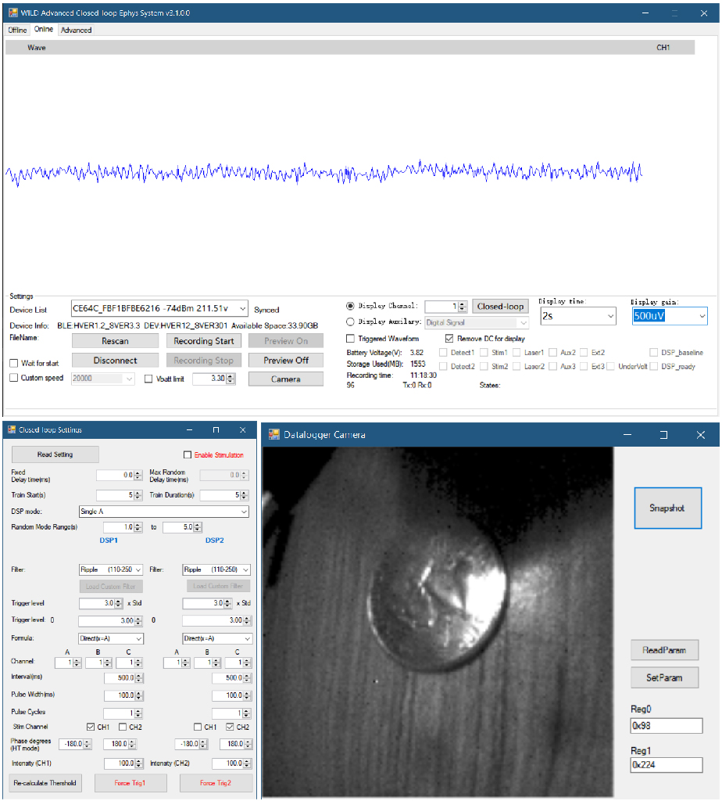
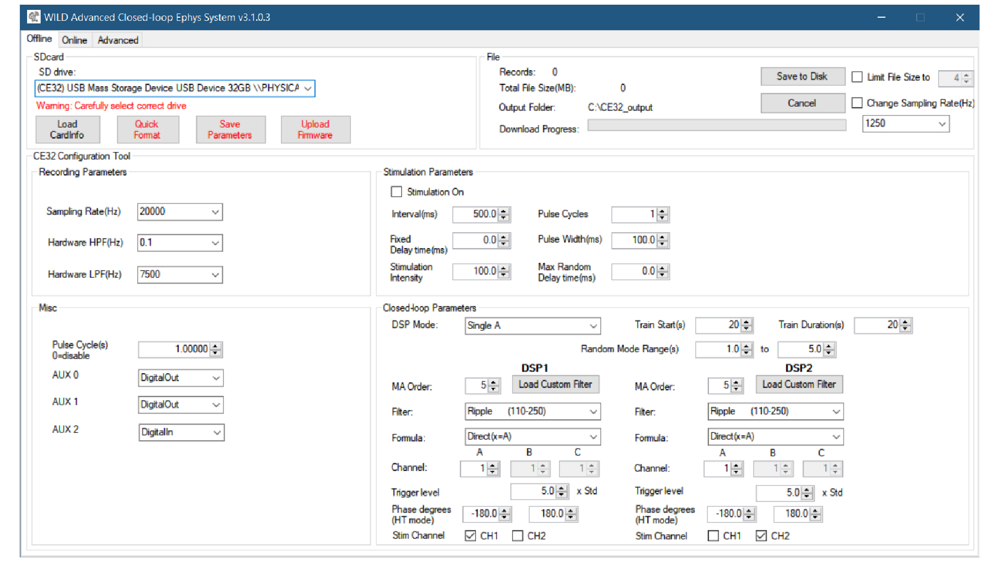

# Acquisition

The acquisition workflow starts in WILD_console and ends with exported recording folders from the device microSD card.

WILD records high-bandwidth neural and multimodal data locally. BLE is used for discovery, synchronization, configuration, status, selected preview, and control commands rather than continuous full-bandwidth data streaming.

## Routine Operation Map

Most first-session work uses four button groups:

| Stage | Main UI area | Primary click |
| --- | --- | --- |
| Discover and connect | Online tab, Device List | Rescan, select the WILD device, then Connect |
| Start recording | Online tab, recording controls | Recording Start |
| Stop recording | Online tab, recording controls | Recording Stop |
| Export data | Offline tab, File panel | Save to Disk |

Closed-loop settings, camera controls, stimulation parameters, GPIO options, and advanced panels are optional experiment-specific controls. They are easier to configure after the basic connect-record-export path is working.

{ .wild-readable-figure }

{ .wild-readable-figure }

## Typical Session

1. Start WILD_console.
2. Scan for the WILD device.
3. Connect over BLE.
4. Read current parameters and change experiment-specific settings only when needed.
5. Configure sampling, closed-loop, camera, stimulation, and GPIO options as needed.
6. Start local recording.
7. Monitor selected preview and state signals.
8. Stop recording.
9. Export data from the SD card.
10. Check duration, file size, representative channels, and sync markers before treating the session as complete.

## Multi-Device Sessions

Use one validated release set across all devices. Assign the intended master/follower roles before the session, and keep the same wiring and start order used in the dry run.

For camera workflows, test the external TTL or camera sync path during a short continuous run and confirm that frames, event pulses, and recording files stay aligned before using the setup with animals.

After export, compare recording durations, file sizes, and sample counts across devices. A successful merge should show stable offsets across the recording; jumps, drifting offsets, or one logger ending early should be investigated before the data are treated as synchronized.

## Exported Files

The exported folder can include:

- `amplifier.dat`.
- `analogin.dat`.
- `digitalin.dat`.
- `adc.dat`.
- `misc.dat`.
- `supply.dat`.
- `time.dat`.
- `info.rhd`.
- WILD parameter binary.

See [Data Format](data-format.md) for field descriptions.
