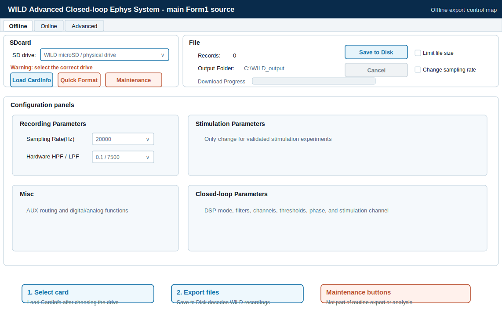

# Data Format

Each recording session exports a folder with neural data, auxiliary signals, metadata, and optional camera or audio files.

## Files

| File | Contents |
| --- | --- |
| `amplifier.dat` | Neural signals as `int16`; sampling rate depends on recording settings. |
| `analogin.dat` | Auxiliary analog data including digital inputs, IMU, time words, and DSP channels. |
| `digitalin.dat` | Digital input data when generated by export workflow. |
| `adc.dat` | Raw ADC channels, including ultrasonic microphone workflows. |
| `misc.dat` | Raw camera data. |
| `time.dat` | Time vector generated during post-processing. |
| `info.rhd` | Intan-compatible metadata header. |
| WILD parameter binary | System and DSP parameters associated with the recording session. |

## Export Decoding

WILD records compact local streams on the device microSD card. During the current SD-card download workflow, WILD_console decodes the on-device recording into analysis-facing files: neural samples are written to `amplifier.dat`, auxiliary and timing words to `analogin.dat`, ADC or audio streams to `adc.dat`, camera payloads to `misc.dat`, and session parameters to the WILD parameter binary.

The exported folder is therefore the decoded public data interface. Raw device storage blocks are not the expected analysis input; downstream MATLAB and Python tools operate on the downloaded files and generate derived outputs such as `info.rhd`, `time.dat`, event files, media files, IMU outputs, and spike-sorting inputs.

{ .wild-readable-figure }

## Time Synchronization

WILD keeps high-bandwidth recordings local while WILD_console provides PC-device coordination over BLE. At connection and recording setup, the console synchronizes device state with the PC session and records timing context with the exported dataset.

The primary sample timeline is reconstructed from the device sampling configuration and sample count. `time.dat` stores the sample-index timeline used by Intan-style workflows, while the WILD parameter binary preserves device-side recording time, hardware version, release image identity, sampling configuration, and DSP settings. External sync lines and digital inputs in `analogin.dat` or generated event files provide the experiment-level alignment path for multi-device sessions and behavioral equipment.

PC-device time synchronization is useful for session organization, export metadata, and cross-device coordination. High-precision alignment relies on hardware sync or digital event channels retained alongside the PC/device timing metadata.

## Multi-Device and Behavior Alignment

For multi-logger sessions, keep the raw export folder for each device and store merge or sync-estimation outputs alongside the derived files. Useful validation checks include matched `amplifier.dat` duration and file size, stable estimated sample offsets, continuous external TTL or digital events, and no unexpected gaps in camera frames.

Behavior datasets should state whether video, UWB, IMU, and ephys streams are expressed on corrected timestamps. Camera calibration, coordinate transforms, identity curation, and delay correction are part of the dataset metadata, especially for outdoor multi-animal work.

When a behavior pipeline produces files such as `behavior_all.mat`, document whether fields are aligned to corrected timestamps such as `timestamps_corrected` and which correction was used. Post-hoc delay estimation or time warping can help evaluate a session, but it should not replace acquisition-side sync validation.

## Intan-Compatible Layout

WILD exports are arranged to be familiar to users of Intan-style recording folders while preserving WILD-specific metadata for sensors, DSP, stimulation, and camera workflows.

## Best Practice

Keep three folders per experiment:

1. Raw SD export.
2. Converted analysis copy.
3. Downstream results from spike sorting, behavior alignment, or machine-learning analysis.
