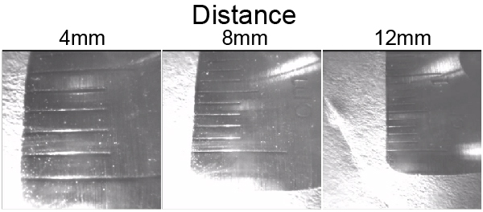

# Live Visualization

WILD_console includes a real-time display for previewing selected neural and auxiliary signals during recording.

Live view supports selected previews, status checks, and closed-loop monitoring. Full-resolution recordings are written locally to the device microSD card.

{ .wild-readable-figure }

## Camera Imaging Profile

{ .wild-readable-figure }

Use the camera imaging profile during bench setup to choose the working distance and focus range before mounting the camera module. Confirm the expected target distance with live preview before treating camera data as part of the experiment record.

## Display Controls

- Select neural preview channels.
- Select auxiliary signals from IMU and DSP outputs.
- Adjust display length.
- Adjust display gain.
- Show threshold overlays when closed-loop channels are selected.
- Monitor internal state, stimulation triggers, DSP state, and TinyML state messages.

## Power and Bandwidth

Live preview consumes device power and BLE bandwidth. Disable preview when the experiment prioritizes maximum runtime over live monitoring, and recover the full dataset from microSD after the session.

## Status Checks

- Confirm connection and TX/RX counters after BLE discovery.
- Confirm synchronization before starting a recording.
- Confirm recording state before handling the animal.
- Confirm export completion after removing the microSD card.
- Treat SD, BLE, low-battery, and release-image mismatch messages as session blockers until resolved.
